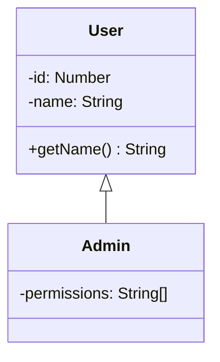

# UML Diagram Generation Skill

Un skill completo para Claude que proporciona experiencia experta en generación de diagramas UML desde representaciones AST.

## 🎯 Propósito

Este skill ayuda a desarrolladores a:
- Convertir AST a diagramas visuales UML
- Elegir y usar engines de rendering (Mermaid, D3.js, SVG personalizado)
- Implementar algoritmos de layout (grid, hierarchical, force-directed)
- Generar outputs en múltiples formatos (SVG, PNG, PDF)
- Estilizar y tematizar diagramas
- Optimizar rendering para diagramas grandes
- Crear diagramas interactivos
- Integrar generación en pipelines de desarrollo

## 🚀 Casos de Uso

### Generación desde AST
```
Usuario: "Tengo un AST de Tree-sitter. ¿Cómo genero un diagrama UML?"
Claude: [Código completo para recorrer AST y generar Mermaid/SVG]
```

### Elección de Tecnología
```
Usuario: "¿Mermaid, D3 o SVG custom? ¿Cuál uso?"
Claude: [Comparación detallada con recomendación para tu caso]
```

### Layout Algorithms
```
Usuario: "Necesito organizar las clases automáticamente"
Claude: [Implementación de algoritmos hierarchical/grid/force-directed]
```

### Export Multi-formato
```
Usuario: "¿Cómo exporto a PNG y PDF?"
Claude: [Código completo de conversión SVG→PNG→PDF]
```

## 📋 Contenido del Skill

### Arquitectura de Generación
```
AST → Extracción → Modelo Intermedio → Layout → Rendering → Export
```

### Tecnologías de Rendering

#### 1. **Mermaid**
- ✅ Texto-based, simple
- ✅ JavaScript-native
- ✅ Soporte built-in en VSCode
- ⚠️ Customización limitada
- **Usar cuando**: Diagramas simples, prototipado rápido

#### 2. **D3.js**
- ✅ Control total
- ✅ Interactividad avanzada
- ✅ Animaciones
- ⚠️ Curva de aprendizaje
- **Usar cuando**: Diagramas interactivos, visualizaciones complejas

#### 3. **SVG Personalizado**
- ✅ Control absoluto
- ✅ Sin dependencias
- ✅ Performance predecible
- ⚠️ Más código
- **Usar cuando**: Requisitos específicos, máxima customización

#### 4. **Graphviz**
- ✅ Excelentes algoritmos de layout
- ⚠️ Dependencia C
- **Usar cuando**: Layout automático es prioritario

### AST a Diagrama - Pipeline

1. **Extracción de Información**
   - Recorrer AST
   - Extraer clases, atributos, métodos
   - Extraer relaciones
   - Construir symbol table

2. **Modelo Intermedio**
   - Estructura de datos independiente del rendering
   - Nodos (clases, interfaces)
   - Edges (relaciones con tipo)
   - Metadata (estilos, posiciones)

3. **Layout Algorithm**
   - Grid layout (simple)
   - Hierarchical (herencia)
   - Force-directed (automático)
   - Manual (user-defined)

4. **Rendering**
   - Generar Mermaid code
   - Generar SVG
   - Renderizar con D3
   - Aplicar themes

5. **Export**
   - SVG (nativo)
   - PNG (via Canvas)
   - PDF (via jsPDF)

### Algoritmos de Layout

#### Grid Layout
```typescript
// Organización simple en grilla
classes.forEach((cls, i) => {
  cls.x = (i % cols) * (WIDTH + GAP);
  cls.y = Math.floor(i / cols) * (HEIGHT + GAP);
});
```

#### Hierarchical Layout
```typescript
// Organiza según jerarquía de herencia
buildInheritanceTree();
assignLevels();
positionByLevel();
```

#### Force-Directed Layout
```typescript
// D3's physics simulation
d3.forceSimulation(nodes)
  .force('link', d3.forceLink(edges))
  .force('charge', d3.forceManyBody())
  .force('center', d3.forceCenter());
```

### Sistema de Themes

```typescript
interface Theme {
  background: string;
  classBox: { fill, stroke, strokeWidth };
  text: { fontFamily, fontSize, color };
  edge: { stroke, strokeWidth };
  shadow: boolean;
}
```

Themes incluidos:
- Light
- Dark
- High-contrast
- Extensible para custom themes

### Export a Múltiples Formatos

- **SVG**: Nativo, escalable
- **PNG**: Via Canvas API, alta resolución
- **PDF**: Via jsPDF + svg2pdf.js

### Optimización para Diagramas Grandes

1. **Virtualización** - Solo renderizar lo visible
2. **Caching** - Reutilizar elementos renderizados
3. **Rendering Incremental** - Procesar por lotes
4. **Lazy Loading** - Cargar bajo demanda

## 🧪 Evaluaciones (Evals)

El skill incluye 9 evaluaciones:

1. **eval-0**: AST Tree-sitter → Mermaid code
2. **eval-1**: Comparación de tecnologías de rendering
3. **eval-2**: Generador SVG custom completo
4. **eval-3**: Algoritmos de layout (grid, hierarchical, force)
5. **eval-4**: Export SVG → PNG/PDF
6. **eval-5**: Drag-and-drop interactivo con D3
7. **eval-6**: Optimización para diagramas grandes
8. **eval-7**: Sistema de themes
9. **eval-8**: DiagramService completo (integración end-to-end)

## 📦 Estructura del Skill

```
uml-diagram-generation-skill/
├── SKILL.md                      # Skill principal
├── README.md                     # Este archivo
├── QUICKSTART.md                 # Guía rápida
└── evals/
    ├── evals.json                # Casos de evaluación
    └── files/
        └── implementation-examples.md  # Código completo
```

## 🎓 Para Qué Proyectos es Útil

- ✅ Generadores de documentación
- ✅ Herramientas de visualización de código
- ✅ IDEs y editores con preview
- ✅ Sistemas de diagramming
- ✅ Reverse engineering tools
- ✅ Educational software
- ✅ Architecture visualization

## 🔧 Cómo Usar Este Skill

### Con Claude
1. Sube `SKILL.md`
2. Pregunta sobre generación de diagramas
3. Recibe implementaciones completas

### Como Referencia
Usa las secciones como guía durante desarrollo:
- Choosing a rendering engine
- Layout algorithms
- Export strategies
- Performance optimization

### Código Listo para Usar
`implementation-examples.md` contiene:
- ✅ MermaidGenerator completo
- ✅ SVGGenerator con themes
- ✅ D3 force-directed diagrams
- ✅ Export service (PNG/PDF)

## 💡 Preguntas que el Skill Maneja Bien

- "¿Cómo convierto mi AST a diagrama?"
- "¿Qué tecnología de rendering uso?"
- "¿Cómo implemento layout automático?"
- "¿Cómo exporto a PNG/PDF?"
- "¿Cómo hago diagramas interactivos?"
- "¿Cómo optimizo diagramas grandes?"
- "¿Cómo implemento themes?"
- "¿Cómo integro todo el pipeline?"

## 🎯 Tu Proyecto: DSL UML

Este skill completa tu pipeline:

```
Parser (Skill 1)
   ↓ AST
VSCode Extension (Skill 2)
   ↓ Triggers
Diagram Generator (Skill 3) ← ESTE SKILL
   ↓ SVG/PNG/PDF
User / Export
```

### Integración Recomendada

1. **Parser** extrae AST
2. **Extension** llama DiagramService
3. **DiagramService** genera y exporta
4. **WebView** muestra preview

## 📚 Complementa con Otros Skills

**Pipeline Completo:**

1. **DSL Parser Development**
   - Diseñar gramática
   - Implementar parser
   - Generar AST

2. **VSCode Extension Development**
   - Crear extensión
   - Integrar parser
   - Comandos y UI

3. **UML Diagram Generation** ← ESTE SKILL
   - AST → Visual
   - Multiple formats
   - Themes & styling

4. **Testing & QA** (próximo)
   - Test generators
   - Validate output
   - Performance testing

## 🚀 Quick Start

```typescript
// 1. Instalar dependencias
npm install mermaid d3 jspdf svg2pdf.js

// 2. Crear generador
import { MermaidGenerator } from './generators/mermaid';

const generator = new MermaidGenerator();
const diagram = generator.generateFromAST(astRoot);

// 3. Renderizar
import mermaid from 'mermaid';
const { svg } = await mermaid.render('diagram', diagram);

// 4. Exportar
import { DiagramExportService } from './export';
const exporter = new DiagramExportService();
const pngBlob = await exporter.exportPNG(svg);
```

## 🎨 Ejemplos Visuales

### Mermaid Output


### SVG Custom Features
- 🎨 Themes (light/dark)
- 📐 Smart layout
- 🎯 Clean rendering
- 💎 Professional styling
- 📱 Responsive sizing

### D3.js Interactive
- 🖱️ Drag-and-drop
- 🔍 Zoom/pan
- ⚡ Force simulation
- 🎭 Animations
- 📊 Dynamic updates

## ⚡ Performance Tips

1. **Usa Mermaid** para ≤20 clases
2. **Usa SVG custom** para 20-100 clases
3. **Usa virtualización** para 100+ clases
4. **Cache** elementos renderizados
5. **Debounce** updates en preview
6. **Lazy load** assets pesados

## 🔍 Troubleshooting

### Mermaid no renderiza
```typescript
// Asegúrate de inicializar
mermaid.initialize({ startOnLoad: true });
```

### SVG corrupto
```typescript
// Valida antes de exportar
const parser = new DOMParser();
const doc = parser.parseFromString(svg, 'image/svg+xml');
if (doc.querySelector('parsererror')) {
  throw new Error('Invalid SVG');
}
```

### PNG borroso
```typescript
// Usa scale factor
await exportPNG(svg, scale: 2); // 2x resolution
```

### Layout malo
```typescript
// Prueba diferentes algoritmos
- Grid: Simple, predecible
- Hierarchical: Para herencia
- Force: Automático, orgánico
```

## 📖 Recursos Adicionales

### Mermaid
- Docs: https://mermaid.js.org/
- Playground: https://mermaid.live/

### D3.js
- Gallery: https://observablehq.com/@d3/gallery
- Force layouts: https://d3js.org/d3-force

### SVG
- Spec: https://www.w3.org/TR/SVG2/
- Tutorial: https://developer.mozilla.org/en-US/docs/Web/SVG

## 🤝 Contribuciones

Mejora el skill agregando:
- Nuevos algoritmos de layout
- Más formatos de export
- Themes adicionales
- Casos de evaluación

## 📄 Licencia

Código abierto - usa libremente.

---

**Convierte código en visualización** 🎨✨

¡Con este skill, tu DSL cobra vida visualmente!
